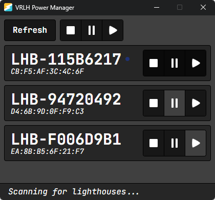

# VRLH Power Manager

Cross-platform program to manually power on and off your virtual reality lighthouses.



## Features

What is the point?

- Automatic base station power management does not work when running SteamVR on Linux
- If using a mixed tracking setup (e.g. Vive trackers with Quest headset), Steam VR might not be able to communicate with your lighthouses
- You can choose for your base stations to either power down (motor off, laser off) or wait in standby mode (motor on, laser off)
  - People have claimed that motor spin up and spin down causes more wear than leaving the motors to run if you play daily
  - You should probably take these claims with a grain of salt, but this program gives you the freedom to choose

## Hardware Requirements

Due to headsets not exposing their bluetooth adapter to the host computer, you will need:

- Your own separate Bluetooth LE Adapter (v4.0+)
  - This [ZEXMTE adapter](https://www.amazon.com/dp/B0775YF36R) seems to work fine for me!

Only the following base stations are supported:

- [Valve Index Base Station](https://store.steampowered.com/app/1059570/Valve_Index_Base_Station/)
- [HTC SteamVR Base Station 2.0](https://www.vive.com/us/accessory/base-station2/)

## Alternative Programs

If this program doesn't suit your needs, one of these might treat you better:

- [OVR-Lighthouse-Manager](https://github.com/kurotu/OVR-Lighthouse-Manager) (Windows App)
- [lighthouse_pm](https://github.com/jeroen1602/lighthouse_pm) (Android App)
- [lighthouse-v2-manager](https://github.com/nouser2013/lighthouse-v2-manager) (Python Script)
- [lhctrl](https://github.com/risa2000/lhctrl) (Python Script)
- [lh2ctrl](https://github.com/risa2000/lh2ctrl) (Python Script)

## For Developers

On Ubuntu, use the following command to install the required build dependencies:

```sh
sudo apt install libgtk-3-dev libwebkit2gtk-4.1-dev libdbus-1-dev pkg-config
```
